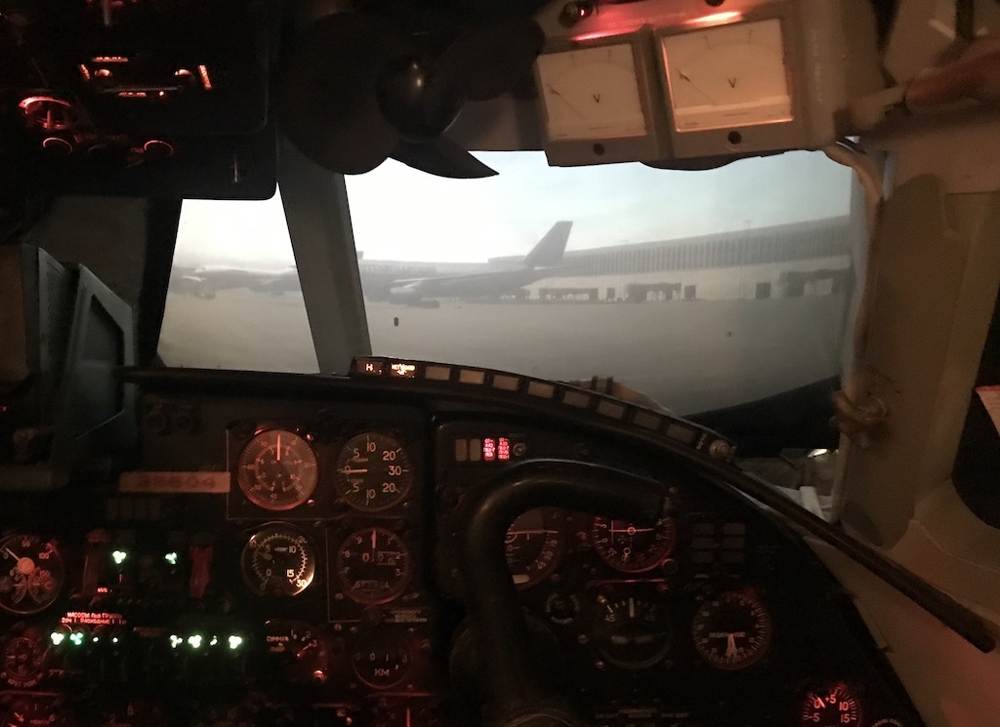

# Antonov 26 Simulator
This repository contains software that implements Visualization system for Antonov An-26 simulator.

# Prerequisities
## Rust
To install Rust toolchain follow the instructions on https://rustup.rs

## Visual Studio Code
To install vscode follow the instructions on https://code.visualstudio.com

Install thr following vscode plugins: [Better TOML](https://marketplace.visualstudio.com/items?itemName=bungcip.better-toml),
[CodeLLDB](https://marketplace.visualstudio.com/items?itemName=vadimcn.vscode-lldb),
[crates](https://marketplace.visualstudio.com/items?itemName=serayuzgur.crates),
[rust-analyzer](https://marketplace.visualstudio.com/items?itemName=matklad.rust-analyzer),
[vscode-rustfmt](https://marketplace.visualstudio.com/items?itemName=statiolake.vscode-rustfmt).

Optional plugins: [Test Explorer UI](https://marketplace.visualstudio.com/items?itemName=hbenl.vscode-test-explorer),
[GitLens](https://marketplace.visualstudio.com/items?itemName=eamodio.gitlens),
[Tabnine AI Code Completion](https://marketplace.visualstudio.com/items?itemName=TabNine.tabnine-vscode),
[Code Spell Checker](https://marketplace.visualstudio.com/items?itemName=streetsidesoftware.code-spell-checker).

# Projects
[SM2XPL](sm2xpl/README.md) - X-Plane plugin