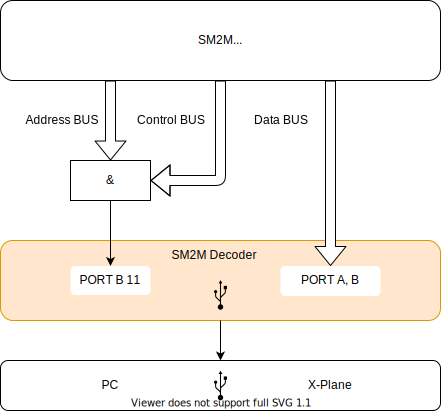

# SM2M Decoder
SM2M Decoder is the decoder of the SM2M computing units signals.
The firmware is developed for STM32F103 microcontroller.
It is build using the RTIC - a concurrency framework for building real-time systems.
You can find more information in the official RTIC book https://rtic.rs/0.5/book/en/.

# High level design


# Communication protocol
Each packet consists of 4 bits of an opcode and a payload. The maximum size of USB packet is is 64 bytes.

## Ping request
The ping request has length of 16 bits with opcode `1`, user defined version starting from `0` up to `255` and random payload. Below is the representation of the request in little-endian byte order.
|Payload 4 bits|Version 8 bits|Opcode 4 bits|
| --- | --- | --- |
|1111|0000 0001|0001|

## Pong request
The pong response has length of 16 bits with opcode `1`, requested version incremented by 1 and requested payload. Below is the representation of the request in little-endian byte order.
|Payload 4 bits|Version 8 bits|Opcode 4 bits|
| --- | --- | --- |
|1111|0000 0010|0001|

## Led request
The led request has length of 8 bits with opcode `2` and led state in 5th bit. `1` the led is on, `0` the led if off. This request does not return response. Below is the representation of the request in little-endian byte order.
|Flags 4 bits|Opcode 4 bits|
| --- | --- |
|0001|0010|

# Build firmware binary
Here we build the firmware binary and then create `.bin` file which we can upload directly to the MCU.
```bash
cargo build --release
cargo objcopy --release -- -O binary ./target/decoder.bin
```

After uploading the built firmware to the MCU we can check that OS has been detected our device by running the command:
```bash
ioreg -p IOUSB -w0 | sed 's/[^o]*o //; s/@.*$//' | grep -v '^Root.*'
```

We should see `STM32 Virtual ComPort` device in the list.

# Upload firmware to MCU using DFU
Before uploading firmware to MCU ensure the size of the firmware can fit in MCU RAM.
```bash
cargo size --release
```

The output will look like this:
```
    Finished release [optimized] target(s) in 0.04s
   text    data     bss     dec     hex filename
  11952       0     776   12728    31b8 sm2m-decoder
```

**Dec** column represents the total size of the firmware in bytes.

To upload compiled firmware you need to make sure that BOOT0 jumper connects BOOT0 to the 3v3 and BOO1 jumper connects BOOT1 to GND.
Then connect the board to USB and run the following command:
```bash
dfu-util -d 0483:df11 -a 0 -s 0x8000000 -D ./target/decoder.bin
```

Alternatively you can create the following shell file:
```bash
cargo build --release && \
cargo objcopy --release -- -O binary ./target/decoder.bin && \
dfu-util -d 0483:df11 -a 0 -s 0x8000000 -D ./target/decoder.bin
```

_Warning!
This method may not work on Chinesse made boards.
Many bluepill boards are know to have a USB pull up resistor with a value far off. It requires to replace the USB DP pull up with the right value. If it's not the case try uploading the firmware using ST-Link V2._

# Upload firmware to MCU using ST-Link V2
To upload compiled ELF binary wuth ST-Link V2 we use `openocd` utility. The ELF itself contains flash start address so we can simply invoke the following command:
```bash
openocd -f ./openocd.cfg -c "init" -c "reset init" -c "flash write_image erase ./target/thumbv7m-none-eabi/release/sm2m-decoder" -c "shutdown"
```

Alternatively you can create the following shell file:
```bash
#!/bin/sh

cargo build --release && \
openocd -f ./openocd.cfg -c "init" -c "reset init" -c "flash write_image erase ./target/thumbv7m-none-eabi/release/sm2m-decoder" -c "shutdown"
```

_In case openocd fails to upload the firmware first time try pressing a `Reset` button on the board before openocd start and release it after you see console message `Info : Listening on port 3333 for gdb connections`. Next time you run openocd it should flash the MCU without errors._

_After flashing complete press `Reset` button on the board._

## ST-Link V2 USB debugger to Blue Pill board connection
The other of pins represents the same order of pins on the Blue Pill board facing MCU and pins down.

| Blue Pill | ST-Link V2 |
| --- | --- |
| **V3** red | **3.3V** pin 8 |
| **IO** brown | **SWDIO** pin 4 |
| **CLK** white | **SWDCLK** pin 2 |
| **GND** black | **GND** pin 6 |

# STM32F103C8T6 Blue Pill pin layout

