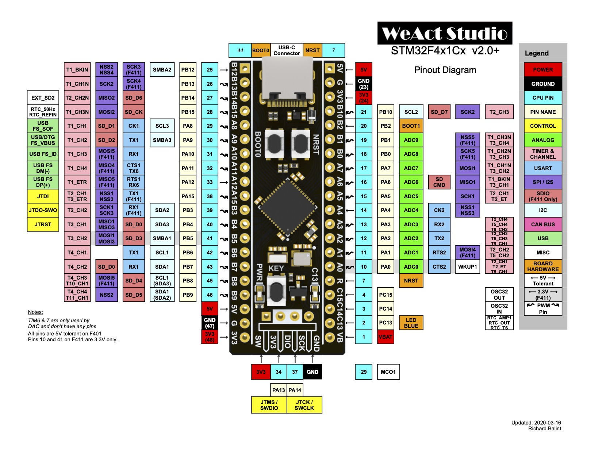

# SM2M Decoder
This is the MCU firmware which decodes SM2M computing units signals representing actual aircraft position, orientation and configuration into the appropriate parameters for simulator visualization system. Decoded signals are send to the host machine using USB interface. It uses RTIC framework. It's a concurrency framework for building real-time systems. You can find more information in the official RTIC book https://rtic.rs/0.5/book/en/. The target MCU is [STM32F411CEU6](https://www.st.com/en/microcontrollers-microprocessors/stm32f411ce.html).

# High level design


# Prerequisities
## Rust
- Install Rust toolchain by following the instructions on https://rustup.rs.
- Install the `rust-std` component `thumbv7em-none-eabihf` to cross-compile for ARM Cortex-M4 MCU using the following command:
```bash
rustup target add thumbv7em-none-eabihf
```
- Install `cargo-binutils` subcommands to invoke the LLVM tools shipped with the Rust toolchain.
```bash
cargo install cargo-binutils 
```
- Install `llvm-tools-preview` component for binary inspection.
```bash
rustup component add llvm-tools-preview
```

## ARM gcc extension for Mac
Before installing extension make sure you have updated [Homebrew](https://brew.sh) packages.
- Install ARM gcc extension and `dfu-util` which is the host side firmware download/upload utility.
```bash
brew install armmbed/formulae/arm-none-eabi-gcc dfu-util
```
- Ensure extension has been installed
```
arm-none-eabi-gcc -v
```

## VS Build Tools for Windows
Download the Visual Studio 2019 Build tools from the Microsoft website: https://visualstudio.microsoft.com/thank-you-downloading-visual-studio/?sku=BuildTools&rel=16

During installation in the `Workloads` tab select `Desktop development with C++`. Select the following items on the `Installation details` page:
- MSVC v142 - VS 2019 C++ ...
- Windows 10 SDK ...
- C++ CMake tools for Windows

You can find more information about the embedded toolchains here https://docs.rust-embedded.org/book/intro/index.html.

# Build firmware binary
Here we build the firmware binary and then create `.bin` file which we can upload directly to the MCU.
```bash
cargo build --release
cargo objcopy --release -- -O binary ./target/decoder.bin
```

# Upload firmware to MCU using DFU
Before uploading firmware to MCU ensure the size of the firmware can fit in MCU RAM.
```bash
cargo size --release
```

The output will look like this:
```
   text    data     bss     dec     hex filename
   2284       0       4    2288     8f0 sm2m-decoder
```

**Dec** column represents the total size of the firmware in bytes. This value should be less than 524287 bytes or 512 Kb. In the example above the firmware size is 2288 bytes or 2 Kb.

Before uploading compiled firmware to the MCU it needs to be put into DFU mode. Press and hold `RESET` button. Then press `BOOT0` and release both of them. This sequent will put MCU in DFU mode so the device can be programmed.

To make sure device is attached an ready to be programmed run the following command `dfu-util -l`. The output will look like this:
```
Found DFU: [0483:df11] ver=2200, devnum=14, cfg=1, intf=0, path="20-3", alt=3, name="@Device Feature/0xFFFF0000/01*004 e", serial="388535883339"
Found DFU: [0483:df11] ver=2200, devnum=14, cfg=1, intf=0, path="20-3", alt=2, name="@OTP Memory /0x1FFF7800/01*512 e,01*016 e", serial="388535883339"
Found DFU: [0483:df11] ver=2200, devnum=14, cfg=1, intf=0, path="20-3", alt=1, name="@Option Bytes  /0x1FFFC000/01*016 e", serial="388535883339"
Found DFU: [0483:df11] ver=2200, devnum=14, cfg=1, intf=0, path="20-3", alt=0, name="@Internal Flash  /0x08000000/04*016Kg,01*064Kg,03*128Kg", serial="388535883339"
```

This means that device `0483:df11` is attached and ready to be programmed.

To upload firmware run the following command:
```bash
dfu-util -d 0483:df11 -a 0 -s 0x8000000 -D ./target/decoder.bin
```
Or invoke `upload.sh` script located in the project root directory.

_After programming complete press `RESET` button on the board to start executing uploaded firmware._

# STM32F4x1 v2.0+ Pin Layout


# Communication protocol
Each packet consists of 8 bits opcode and optional payload. The maximum size of the packet is 1Kb. Packet received by MCU from host machine is called inbound. Packet sent from host machine to MCU is called outbound. Some of the inbound packets obligates host machine to receive response outbound packets.

## Inbound: Firmware version
Request firmware version. Packet length is 8 bits (1 byte) with opcode `1`. Below is the representation of the packet in little-endian byte order:

|Opcode 8 bits|
| --- |
|0000 0011|

## Outbound: Firmware version
Response firmware version. Packet length is 32 bits (4 bytes) with opcode `1`, 8 bits of major version with values between `1` and `254`, 8 bits of minor version with values between `0` and `254` and 8 bits of patch version with values between `0` and `254`. Below is the representation of the packet in little-endian byte order which contains firmware version `1.5.8`:

|Patch 8 bits|Minor 8 bits|Major 8 bits|Opcode 8 bits|
| --- | --- | --- | --- |
|0000 1000|0000 0101|0000 0001|0000 0001|

# Supported parameters map
The decoder is able to decode 255 parameters described in the table below with assigned indexes:

|Index|Parameter name|Size|
| --- | --- | --- |
|0|Latitude hi|16 bits|
|1|Latitude lo|16 bits|
|2|Longitude hi|16 bits|
|3|Longitude lo|16 bits|
|4|Altitude hi|16 bits|
|5|Heading|16 bits|
|6|Pitch|16 bits|
|7|Roll|16 bits|
|8|Gear front|16 bits|
|9|Gear left|16 bits|
|10|Gear right|16 bits|
|11|Flags|16 bits|
|The rest of indexes are reserved|
