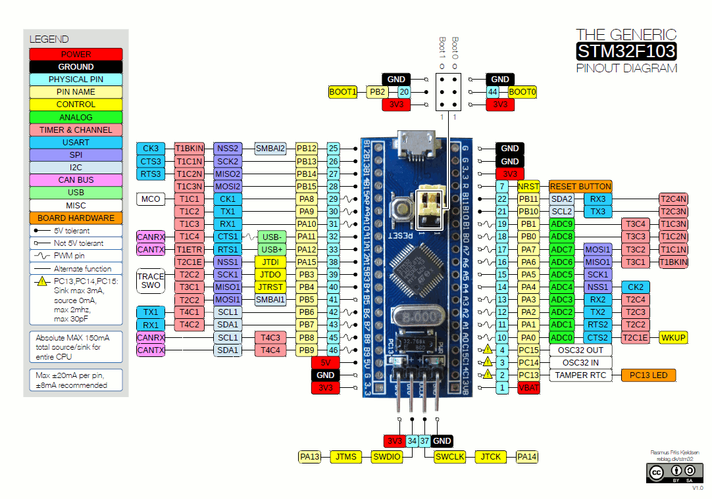

# SM2M Emulator
This is the MCU firmware which emulates SM2M computing unit by sending identical signals from SM2M data bus and receive signals sent from SM2M encoder. It uses RTIC framework. It's a concurrency framework for building real-time systems. You can find more information in the official RTIC book https://rtic.rs/0.5/book/en/. The target MCU is [STM32F103C8T6](https://www.st.com/en/microcontrollers-microprocessors/stm32f103c8.html).

# High level design


# Prerequisities
## Rust
- Install Rust toolchain by following the instructions on https://rustup.rs.
- Install the `rust-std` component `thumbv7em-none-eabihf` to cross-compile for ARM Cortex-M4 MCU using the following command:
```bash
rustup target add thumbv7em-none-eabihf
```
- Install `cargo-binutils` subcommands to invoke the LLVM tools shipped with the Rust toolchain.
```bash
cargo install cargo-binutils 
```
- Install `llvm-tools-preview` component for binary inspection.
```bash
rustup component add llvm-tools-preview
```

## ARM gcc extension for Mac
Before installing extension make sure you have updated [Homebrew](https://brew.sh) packages.
- Install ARM gcc extension and open on-chip debugger.
```bash
brew install armmbed/formulae/arm-none-eabi-gcc openocd
```
- Ensure extension has been installed
```
arm-none-eabi-gcc -v
```

## VS Build Tools for Windows
Download the Visual Studio 2019 Build tools from the Microsoft website: https://visualstudio.microsoft.com/thank-you-downloading-visual-studio/?sku=BuildTools&rel=16

During installation in the `Workloads` tab select `Desktop development with C++`. Select the following items on the `Installation details` page:
- MSVC v142 - VS 2019 C++ ...
- Windows 10 SDK ...
- C++ CMake tools for Windows

You can find more information about the embedded toolchains here https://docs.rust-embedded.org/book/intro/index.html.

# Build firmware binary
To build the release version of the firmware use the following command:
```bash
cargo build --release
```

# Upload firmware to MCU using ST-Link
Before uploading firmware to MCU ensure the size of the firmware can fit in MCU RAM.
```bash
cargo size --release
```

The output will look like this:
```
   text    data     bss     dec     hex filename
  11832       0     896   12728    31b8 sm2m-emulator
```

**Dec** column represents the total size of the firmware in bytes. This value should be less than 65535 bytes or 64 Kb. In the example above the firmware size is 12728 bytes or 12.5 Kb.

To upload compiled ELF binary with ST-Link we use `openocd` utility. The ELF itself contains flash start address so we can simply invoke the following command:
```bash
openocd -f ./openocd.cfg -c "init" -c "reset init" -c "flash write_image erase ./target/thumbv7m-none-eabi/release/sm2m-decoder" -c "shutdown"
```
Or invoke `upload.sh` script located in the project root directory.

_In case openocd fails to upload the firmware first time try pressing a `Reset` button on the board before openocd start and release it after you see console message `Info : Listening on port 3333 for gdb connections`. Next time you run openocd it should program the MCU without errors._

_After programming complete press `Reset` button on the board to start executing uploaded firmware._

## ST-Link V2 USB debugger to Blue Pill board connection
The other of pins represents the same order of pins on the Blue Pill board facing MCU and pins down.

| Blue Pill | ST-Link V2 |
| --- | --- |
| **V3** red | **3.3V** pin 8 |
| **IO** brown | **SWDIO** pin 4 |
| **CLK** white | **SWDCLK** pin 2 |
| **GND** black | **GND** pin 6 |

# STM32F103C8T6 Blue Pill pin layout


# Communication protocol
Each packet consists of 8 bits opcode and optional payload. The maximum size of the packet is 1Kb. Packet received by MCU from host machine is called inbound. Packet sent from host machine to MCU is called outbound. Some of the inbound packets obligates host machine to receive response outbound packets.

## Inbound: Firmware version
This inbound packet has length of 8 bits (1 byte) of opcode `1`. Below is the representation of the packet in little-endian byte order:

|Opcode 8 bits|
| --- |
|0000 0011|

## Outbound: Firmware version
This outbound packet has length of 32 bits (4 bytes) with opcode `1`, 8 bits of major version with values between `1` and `254`, 8 bits of minor version with values between `0` and `254` and 8 bits of patch version with values between `0` and `254`. Below is the representation of the packet in little-endian byte order which contains firmware version `1.5.8`:

## Inbound: Set parameter
The request has length of 24 bits (3 bytes) with 4 bits of opcode `4`, 4 bits of parameter index starting from `0` up to `12` and 16 bits of parameter value. This request does not return any response. Below is the representation of the request in little-endian byte order which sets parameter at index `0` with value `21845`:
|Parameter value 16 bit|Index 4 bits|Opcode 4 bits|
| --- | --- | --- |
|0101 0101 0101 0101|0000|0100|

## Inbound: Get parameter
The request has length of 8 bits (1 byte) with 4 bits of opcode `5` and 4 bits of parameter index starting from `0` up to `12`. A host can expect parameter response sent from the device. Below is the representation of the request in little-endian byte order which requests parameter at index `0`:
|Index 4 bits|Opcode 4 bits|
| --- | --- |
|0000|0101|

## Outbound: Parameter
The response has length of 24 bits (3 bytes) with 4 bits of opcode `4`, 4 bits of parameter index starting from `0` up to `12` and 16 bits of parameter value. Below is the representation of the response in little-endian byte order with index `0` and value `21845`:
|Parameter value 16 bit|Index 4 bits|Opcode 4 bits|
| --- | --- | --- |
|0101 0101 0101 0101|0000|0100|

# Supported parameters map
The decoder is able to decode 12 parameters described in the table below with assigned indexes:
|Index|Parameter name|Size|
| --- | --- | --- |
|1|Latitude hi|16 bits|
|2|Latitude lo|16 bits|
|3|Longitude hi|16 bits|
|4|Longitude lo|16 bits|
|5|Altitude hi|16 bits|
|6|Heading|16 bits|
|7|Pitch|16 bits|
|8|Roll|16 bits|
|9|Gear front|16 bits|
|10|Gear left|16 bits|
|11|Gear right|16 bits|
|12|Flags|16 bits|
