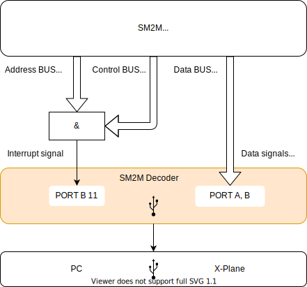

# SM2M Decoder
SM2M Decoder is the decoder of the SM2M computing units signals.
The firmware is developed for STM32F103 microcontroller.
It is build using the RTIC - a concurrency framework for building real-time systems.
You can find more information in the official RTIC book https://rtic.rs/0.5/book/en/.

# High level design


# Communication protocol
Each packet consists of 4 bits opcode and payload. The maximum size of USB packet is is 64 bytes. Sending some of the request inbound packets obligates host side to receive response outbound packets. The may have different opcodes compared to inbound.

## Outbound: Common error
The protocol has common error outbound packet which can be sent from the device to the host in response for some command. This outbound packet has length of 8 bits (1 byte) with 4 bits of opcode `1`. The rest 4 bits are either ignored or contain additional error reason depending on the inbound packet. The reason is an integer value between `1` and `15`. Below is the representation of the packet in little-endian byte order with error reason `1`:

|Optional 4 bits reason|Opcode 4 bits|
| --- | --- |
|0001|0001|

## Inbound: Get firmware version
This inbound packet has length of 8 bits (1 byte) with 4 bits of opcode `1`. The rest 4 bits are ignored. Below is the representation of the packet in little-endian byte order:

|Ignored 4 bits|Opcode 4 bits|
| --- | --- |
|0000|0011|

## Outbound: Firmware version
This outbound packet has length of 16 bits (2 bytes) with 4 bits of opcode `2`, 4 bits of major version between `1` and `15` and 8 bits of minor version between `0` and `254`. Below is the representation of the packet in little-endian byte order which contains firmware version `1.5`:

|Minor 8 bits|Major 4 bits|Opcode 4 bits|
| --- | --- | --- |
|0000 0101|0001|0010|

## Inbound: Ping
The request has length of 16 bits (2 bytes) with 4 bits of opcode `2`, 4 bits of random payload and 8 bits of user defined version starting from `0` up to `255`. A host can expect pong response sent from the device. Below is the representation of the request in little-endian byte order with payload `15` and version `1`:
|Version 8 bits|Payload 4 bits|Opcode 4 bits|
| --- | --- | --- |
|0000 0001|1111|0001|

## Outbound: Pong
The response has length of 16 bits (2 bytes) with 4 bits of opcode `3`, 4 bits of requested payload and 8 bits of requested version incremented by 1. Below is the representation of the response in little-endian byte order with payload `15` and version `2`:
|Version 8 bits|Payload 4 bits|Opcode 4 bits|
| --- | --- | --- |
|0000 0010|1111|0011|

## Inbound: Status led
The request has length of 8 bits (1 byte) with 4 bits of opcode `3` and 1 bit of led state located in 5th bit. If the state bit is set the led will be turned on, otherwise it'll be turned off. This request does not return any response. Below is the representation of the request in little-endian byte order which turns on status led:
|Flags 4 bits|Opcode 4 bits|
| --- | --- |
|0001|0011|

## Inbound: Set parameter
The request has length of 24 bits (3 bytes) with 4 bits of opcode `4`, 4 bits of parameter index starting from `0` up to `12` and 16 bits of parameter value. This request does not return any response. Below is the representation of the request in little-endian byte order which sets parameter at index `0` with value `21845`:
|Parameter value 16 bit|Index 4 bits|Opcode 4 bits|
| --- | --- | --- |
|0101 0101 0101 0101|0000|0100|

## Inbound: Get parameter
The request has length of 8 bits (1 byte) with 4 bits of opcode `5` and 4 bits of parameter index starting from `0` up to `12`. A host can expect parameter response sent from the device. Below is the representation of the request in little-endian byte order which requests parameter at index `0`:
|Index 4 bits|Opcode 4 bits|
| --- | --- |
|0000|0101|

## Outbound: Parameter
The response has length of 24 bits (3 bytes) with 4 bits of opcode `4`, 4 bits of parameter index starting from `0` up to `12` and 16 bits of parameter value. Below is the representation of the response in little-endian byte order with index `0` and value `21845`:
|Parameter value 16 bit|Index 4 bits|Opcode 4 bits|
| --- | --- | --- |
|0101 0101 0101 0101|0000|0100|

# Supported parameters map
The decoder is able to decode 12 parameters described in the table below with assigned indexes:
|Index|Parameter name|Size|
| --- | --- | --- |
|1|Latitude hi|16 bits|
|2|Latitude lo|16 bits|
|3|Longitude hi|16 bits|
|4|Longitude lo|16 bits|
|5|Altitude hi|16 bits|
|6|Heading|16 bits|
|7|Pitch|16 bits|
|8|Roll|16 bits|
|9|Gear front|16 bits|
|10|Gear left|16 bits|
|11|Gear right|16 bits|
|12|Flags|16 bits|

# Build firmware binary
Here we build the firmware binary and then create `.bin` file which we can upload directly to the MCU.
```bash
cargo build --release
cargo objcopy --release -- -O binary ./target/decoder.bin
```

After uploading the built firmware to the MCU we can check that OS has been detected our device by running the command:
```bash
ioreg -p IOUSB -w0 | sed 's/[^o]*o //; s/@.*$//' | grep -v '^Root.*'
```

We should see `STM32 Virtual ComPort` device in the list.

# Upload firmware to MCU using DFU
Before uploading firmware to MCU ensure the size of the firmware can fit in MCU RAM.
```bash
cargo size --release
```

The output will look like this:
```
    Finished release [optimized] target(s) in 0.04s
   text    data     bss     dec     hex filename
  11952       0     776   12728    31b8 sm2m-decoder
```

**Dec** column represents the total size of the firmware in bytes.

To upload compiled firmware you need to make sure that BOOT0 jumper connects BOOT0 to the 3v3 and BOO1 jumper connects BOOT1 to GND.
Then connect the board to USB and run the following command:
```bash
dfu-util -d 0483:df11 -a 0 -s 0x8000000 -D ./target/decoder.bin
```

Alternatively you can create the following shell file:
```bash
cargo build --release && \
cargo objcopy --release -- -O binary ./target/decoder.bin && \
dfu-util -d 0483:df11 -a 0 -s 0x8000000 -D ./target/decoder.bin
```

_Warning!
This method may not work on Chinesse made boards.
Many bluepill boards are know to have a USB pull up resistor with a value far off. It requires to replace the USB DP pull up with the right value. If it's not the case try uploading the firmware using ST-Link V2._

# Upload firmware to MCU using ST-Link V2
To upload compiled ELF binary wuth ST-Link V2 we use `openocd` utility. The ELF itself contains flash start address so we can simply invoke the following command:
```bash
openocd -f ./openocd.cfg -c "init" -c "reset init" -c "flash write_image erase ./target/thumbv7m-none-eabi/release/sm2m-decoder" -c "shutdown"
```

Alternatively you can create the following shell file:
```bash
#!/bin/sh

cargo build --release && \
openocd -f ./openocd.cfg -c "init" -c "reset init" -c "flash write_image erase ./target/thumbv7m-none-eabi/release/sm2m-decoder" -c "shutdown"
```

_In case openocd fails to upload the firmware first time try pressing a `Reset` button on the board before openocd start and release it after you see console message `Info : Listening on port 3333 for gdb connections`. Next time you run openocd it should flash the MCU without errors._

_After flashing complete press `Reset` button on the board._

## ST-Link V2 USB debugger to Blue Pill board connection
The other of pins represents the same order of pins on the Blue Pill board facing MCU and pins down.

| Blue Pill | ST-Link V2 |
| --- | --- |
| **V3** red | **3.3V** pin 8 |
| **IO** brown | **SWDIO** pin 4 |
| **CLK** white | **SWDCLK** pin 2 |
| **GND** black | **GND** pin 6 |

# STM32F103C8T6 Blue Pill pin layout

