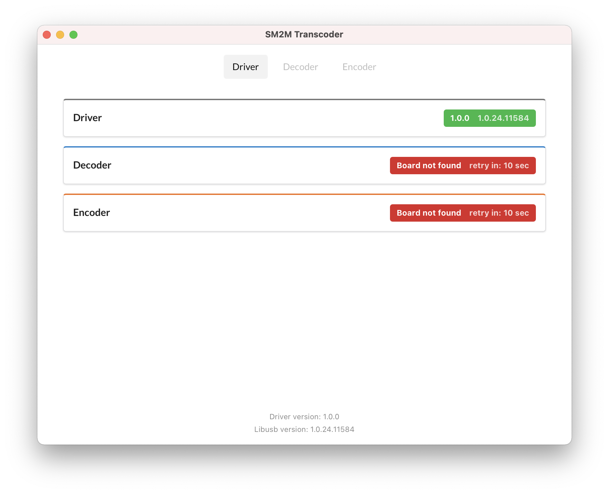

# SM2M Transcoder
SM2M Transcoder is the UI application which can read and write aircraft parameters to SM2M encoder and decoder.



## Install dependencies
To install all required dependencies execute the following command:
```bash
npm ci
```

# Run application in development mode
```bash
npm run tauri dev
```

# Build release version
```bash
npm run tauri build
```

An application files will be located in `src-tauri/target/release/bundle/` directory.
